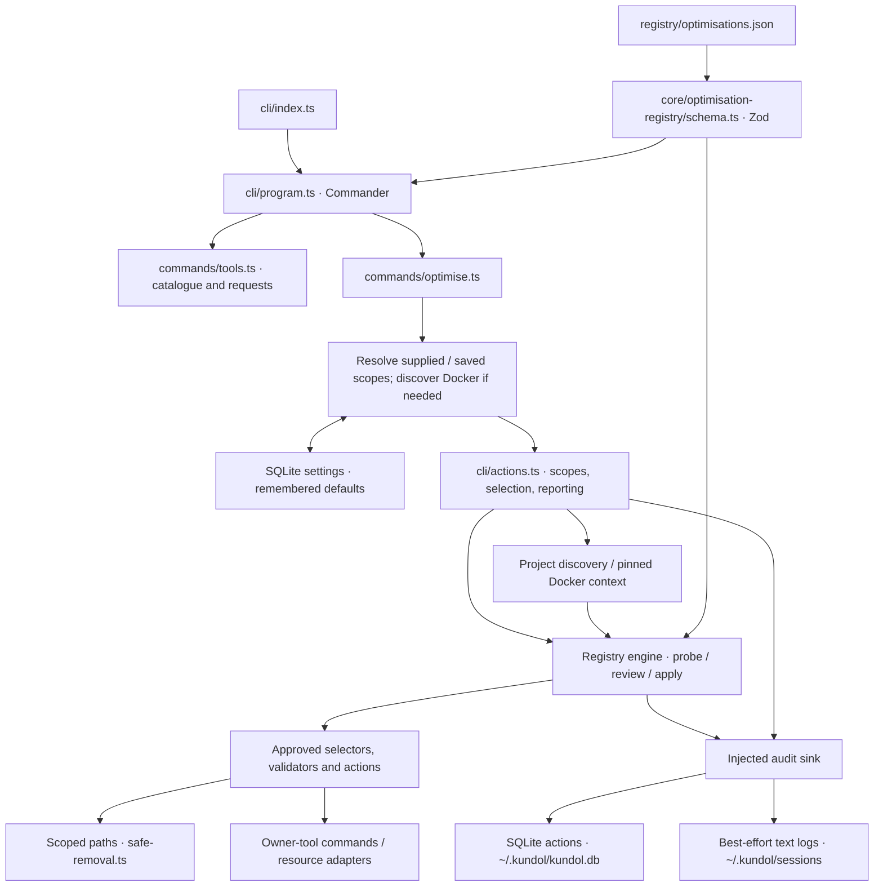

# kundol Architecture

Created: 2026-06-13 07:24:10 IST
Last updated: 2026-09-17 10:28:16 IST
Related tasks: `KUN-101`, `KUN-102`, `KUN-103`, `KUN-104`

kundol is a Bun + TypeScript CLI. The bundled registry describes cleanup rules; code-owned handlers determine what can execute. See [codebase context](context.md) for detailed behavior and limits.

## Components



- **CLI:** [program.ts](../src/cli/program.ts) wires Commander, registry validation, and injectable dependencies; [actions.ts](../src/cli/actions.ts) coordinates scopes, prints plans, collects selection, and reports results. Catalogue commands read registry data; request/issue commands open GitHub pages.
- **Rule contract:** [schema.ts](../src/core/optimisation-registry/schema.ts) validates [registry JSON](../registry/optimisations.json), including scope, lifecycle status, selectors, actions, validators, and review policy.
- **Engine:** [engine.ts](../src/services/optimisation-registry/engine.ts) owns eligibility, bounded concurrent probes, deduplication, review plans, live validation, and sequential execution. Services do not import CLI presentation.
- **Handlers:** [local-handler-bindings.ts](../src/services/optimisation-registry/local-handler-bindings.ts), [path-targets.ts](../src/services/optimisation-registry/path-targets.ts), and [commands.ts](../src/services/optimisation-registry/commands.ts) bind rules to approved adapters, generated-path selectors, or owner commands. JSON cannot introduce arbitrary executable behavior.
- **Scopes:** [project-roots.ts](../src/services/optimisation-registry/project-roots.ts) discovers marker-backed roots under the resolved supplied or saved workdir; [docker-context-identity.ts](../src/services/optimisation-registry/docker-context-identity.ts) and [docker-pinned-runner.ts](../src/services/optimisation-registry/docker-pinned-runner.ts) pin Docker operations to a named context and daemon.
- **Persistence:** [db/client.ts](../src/db/client.ts) and [action-repository.ts](../src/db/repositories/action-repository.ts) store action audits; SQLite settings store canonical project-directory and validated Docker-context defaults; [session-audit-log.ts](../src/services/audit/session-audit-log.ts) writes text sessions. Historical migration tables remain for compatibility, not active workspace indexing.
- **Infrastructure:** `src/config/`, `src/platform/`, and `src/shared/` provide paths, home/clock abstractions, output formatting, and exit codes. Tests inject temporary roots, runners, clocks, and database paths.

## Execution flow

```mermaid
sequenceDiagram
    actor User
    participant CLI as CLI actions
    participant Engine as Registry engine
    participant Handler as Approved handlers
    participant Audit as Audit sink
    User->>CLI: optimise scope + options
    CLI->>CLI: Resolve and validate scopes; persist initial or requested defaults
    CLI->>Engine: probe eligible rules
    Engine->>Handler: Discover and validate targets
    Handler-->>Engine: Identities, evidence, sizes / unavailable reasons
    Engine-->>CLI: Probe plan
    CLI-->>User: Print plan
    User->>CLI: Select targets (or force-safe selection)
    CLI->>Engine: review original plan + selection
    Engine-->>CLI: Single-use review plan
    CLI->>Engine: apply review plan
    loop Each selected target, sequentially
        Engine->>Handler: Re-probe identity and validate
        Engine->>Audit: Record attempt before action
        Engine->>Handler: Validate again, execute only if valid
        Engine->>Audit: Record applied / skipped / failed
    end
    Engine-->>CLI: Results and audit warnings
    CLI->>Audit: Record run outcome
    CLI-->>User: Report + exit status
```

- **Routes:** `storage` uses user scope; `projects` and `repos` use workdir scope (`repos` does not require Git); `docker` resolves and pins a supplied, saved, or discovered named context. `all` resolves both scopes and adds system-scope readiness. Initial valid defaults are persisted; later explicit values are temporary unless `--save-defaults` is supplied. Stale defaults fail without fallback.
- **Combined plans:** `all` probes four scopes concurrently using three engines (system reuses the storage engine), rejects duplicate resources and identical/nested paths, and collects one selection. Original engine plans remain authoritative; scope plans apply sequentially.
- **Selection:** Every run prints its plan. `-f` selects only safe, force-eligible targets; review targets require explicit selection and protected inventory cannot be selected. After scope resolution, no TTY without force records cancellation. Docker discovery with multiple contexts needs a numbered choice or an explicit context, even with force. Standalone Docker has no force option.
- **Audits and errors:** Target events reuse one lazily opened SQLite connection per apply run, closed before the summary. Attempt-audit failure prevents that action; outcome-audit failures surface as warnings. Failed target actions produce exit code 70.

## Safety and capability boundaries

- **Release gates:** Status, scope, platform, handler support, and safety policy must match. [beta-execution.ts](../src/services/optimisation-registry/beta-execution.ts) permits five exact opt-in beta IDs: Yarn cache review, two Linux Python review rules, and two protected Docker inventories.
- **Live checks:** Apply accepts only its engine's issued, unused review plan and rechecks target identity and applicable validators. Generated-path activity checks precede sizing: activity is bounded at 150,000 entries; sizing at 50,000 (incomplete size is unknown).
- **Removal:** [safe-removal.ts](../src/services/optimisation-registry/safe-removal.ts) uses an isolated system-Python helper with no-follow, descriptor-relative removal and fails closed if unsupported. The remaining final leaf-name replacement race is documented in [context](context.md).
- **Current limits:** No Docker cleanup rule is published; beta network/volume inventory never removes resources. Staged adapters do not imply public availability. Broad Docker prune, arbitrary temp cleanup, startup changes, archives, a daemon, and a dashboard are outside the current CLI.

See [usage](usage.md) for commands and the [registry guide](optimisation-registry.md) for extension/publication gates. Verification lives in [CLI tests](../tests/cli/), [engine and adapter tests](../tests/services/), and [isolated Docker acceptance tests](../tests/docker-acceptance/README.md).
